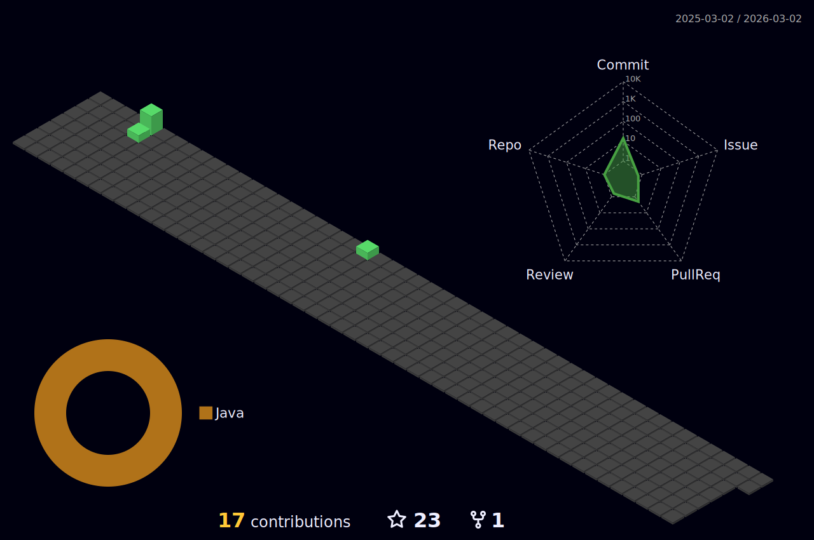

<h1 align="center">Hi 👋, I'm Suresh</h1>
<h3 align="center">A passionate backend developer from India</h3>

- 🏫 I’m currently studying at **Masai School,Banglore**

- 🌱 I’m currently learning **Backend Java Developer**

- 💬 Ask me about **Tech because I love to learn about tech.**

- 📫 How to reach me **suresh.20fk@gmail.com**

- ⚡ Fun fact **I can be a mood booster sometimes but you need give me your time first.**

<h3 align="left">Connect with me:</h3>

<h3 align="left">Languages and Tools:</h3>

          

