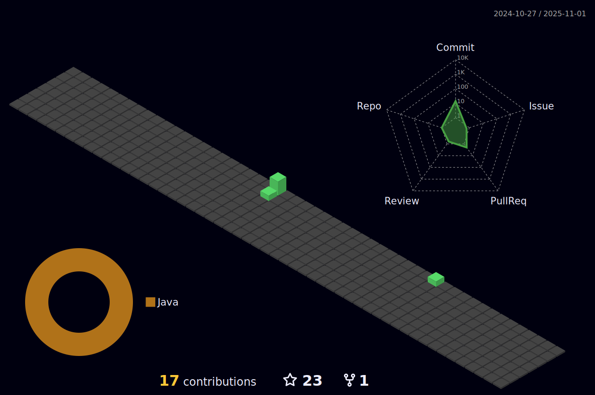

## Hey , I'm [Suresh!](https://suresh170411.github.io/) 

### 🌱 I’m from Balasore, Odisha, India .
### 🌱 I’m currently learning ...
- Java, Aspiring Java Backend Developer

### 🌱 What do I do?
- ✔️ I am passionate about coding and tech so looking forward to make a career in tech.😉

- ✔️I'm a fast learner looking for interesting career opportunities as a Java developer. 

### ⚡ One line that describes me best? 
- ✔️ Chilled person filled with good sense of humor.
- I love talking About Code and meeting with different people so if you want to say hi, I'll be curious to know more! 😊😊

### ⚡ 💬 Ask me about:
- Anything ( not my personal life , duhh !! )

### 📫 How can you reach me?

###🛠️ Technologies and Tools I use:

<!-- coding boy -->

 

 
 
 

 

### Used Tools:

 
 
 
 
  
<h2 align="center">📊 My Github Stats<h2>

  
  

   
  

  
  

  
 

